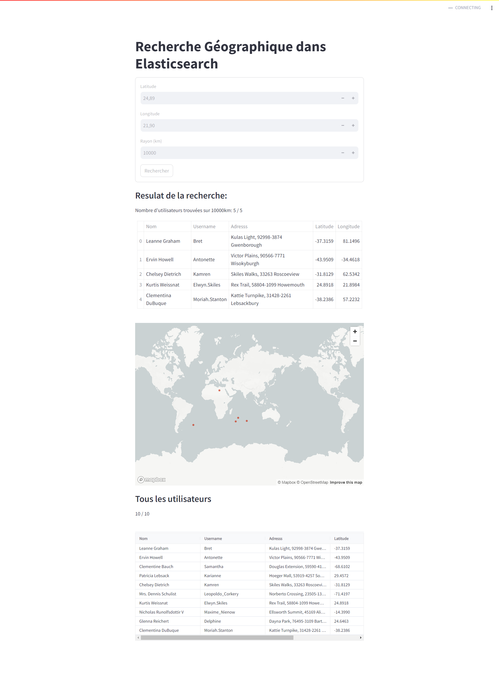

# Projet

Le projet vise à développer une application qui répond aux besoins suivants :
- Enregistrement des Utilisateurs : Permettre aux individus de s'enregistrer en fournissant des informations personnelles et leurs coordonnées de géolocalisation. L'enregistrement peut se faire soit individuellement, soit par lot à travers l'importation de fichiers JSON.
- Indexation des Données : Les données fournies par les utilisateurs seront indexées à l'aide d'un moteur d'indexation. Cette étape est cruciale pour optimiser les performances de recherche au sein de l'application.
- Recherche géolocalisée : Offrir une fonction de recherche permettant de trouver des utilisateurs en fonction de leur position géographique et dans un rayon spécifié par le demandeur.
- Affichage des Résultats : Les résultats de chaque recherche devront présenter les informations complètes des personnes trouvées, permettant ainsi des mises en relation efficaces et pertinentes.

# Technologies Utilisées
Pour répondre aux exigences fonctionnelles et techniques de ce projet, nous avons sélectionné un ensemble de technologies éprouvées et performantes :
- Langage de Développement : Python, choisi pour sa flexibilité, sa facilité d'utilisation et son vaste écosystème de bibliothèques, notamment pour le traitement des données et l'intégration avec les systèmes de bases de données et d'indexation.
- Moteur d'Indexation : Elasticsearch, retenu pour sa capacité à gérer de grandes quantités de données géolocalisées et à effectuer des recherches rapides et précises basées sur la géolocalisation.
- SGBDR : MongoDB, une base de données NoSQL orientée documents, sélectionnée pour sa flexibilité dans le stockage et la gestion des données structurées de manière hiérarchique, ce qui est particulièrement adapté aux données personnelles et géolocalisées des utilisateurs.


# INSTALL
Install python virtual env

```console
pip install --upgrade pip
sudo apt install python3-virtualenv
pip install --upgrade virtualenv
```

# Create virtual Env
Install python lib

```shell
virtualenv -p python3 venv
chmod +x venv/bin/activate
```
Install python lib
```shell
pip install -r requirements.txt
```

# RUN
Activate python venv
```shell
source ./venv/bin/activate
```

### Import dataset to mongoDb 
```shell
python src/utils/import_mongodb.py 
```

### Import dataset to Elasticseacrh 
```shell
python src/utils/create_search_index.py
```

# Run app
```shell
yarn start
# or
streamlit run src/streamlitappuser.py
```

# Capture



[](https://www.paypal.com/donate/?hosted_button_id=FSXZJUZCHWG5N)

